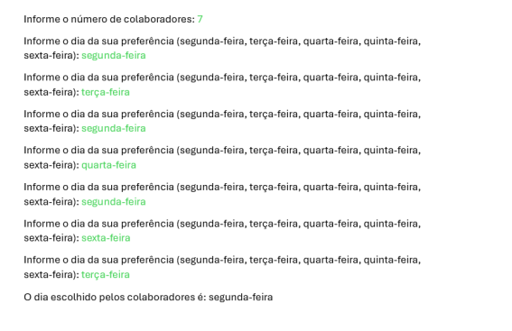
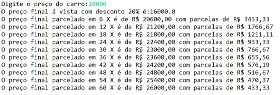
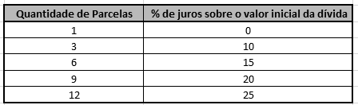
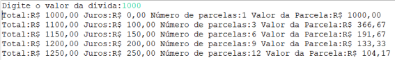

# Exercício de loops

Exercícios de Loops da fase 2 do curso de ADS da FIAP.

# Enunciado dos Exercícios

**Exercício 1 :**

A Bidu é uma startup na área de Fintech fundada em 2011 que ajuda os usuários a controlar suas fontes de receitas, gastos, dívidas e investimentos.  Ela precisa realizar uma votação para escolher qual dia da semana é o melhor para a realização das lives com o time da mentoria financeira. Desenvolva um programa em que os colaboradores informem um dos 5 dias da semana (segunda-feira, terça-feira, quarta-feira, quinta-feira e sexta-feira) da sua preferência para participar da live. Verifique e exiba ao final, qual dia foi o escolhido pelos colaboradores. 

Observação: Verifique o número de colaboradores que irão participar da votação para programar sua estrutura de repetição.

Ponto de atenção: É importante o programa validar a possibilidade de empate.

Modelo de saída:

.

**Exercício 2 :** 

A compra de um veículo pode ser realizada parcelada. Crie um programa que receba o valor de um carro e mostre uma tabela com os seguintes dados: preço final, quantidade de parcelas e valor da parcela. Considere o seguinte:

a) O preço final para compra à vista tem um desconto de 20%.

b) A quantidade de parcelas pode ser 6, 12, 18, 24, 30, 36, 42, 48, 54 e 60. Os percentuais de acréscimo seguem na tabela abaixo: 

|Parcelas|Preço Final| 
|:---|:---|
| 6 |3%|
| 12|6%|
| 18|9%|
| 24|12%|
| 30|15%|
| 36|18%|
| 42|21%|
| 48|24%|
| 54|27%|
| 60|30%|

Modelo de saída: 

**Exercício 3 :**

Na oferta de um produto de crédito aos clientes, três informações são muito importantes apresentar ao cliente: valor da dívida, a taxa de juros e o número de parcelas para pagamento do empréstimo contraído junto à Fintech. Faça um programa que receba o valor de uma dívida e mostre uma tabela com os seguintes dados:

Valor da dívida, valor do juros, quantidade de parcelas e valor da parcela. Os juros e a quantidade de parcelas seguem a tabela:

Modelo de Saída:

**Exercício 4 :**

Toda vez que um cliente realiza um resgate de uma aplicação financeira, o sistema deve calcular a alíquota de imposto de renda (IR) que deve ser aplicada sobre aquele resgate, levando em consideração o número de dias que o valor permaneceu aplicado, de acordo com a tabela abaixo:

Até 180 dias = alíquota de 22,5% de IR.

De 181 a 360 dias = alíquota de 20% de IR.

De 361 a 720 dias = alíquota de 17,5% de IR.

Acima de 720 dias = alíquota de 15% de IR.

É o que acontece, por exemplo, com o Certificado de Depósito Bancário (CDB), uma aplicação de renda fixa comumente oferecida pelas Fintechs. Outros investimentos em renda fixa, como LCI e LCA, respectivamente, Letra de Crédito Imobiliário e Letra de Crédito do Agronegócio são isentos de imposto de renda. Escreva um programa que receba o tipo de investimento do qual se deseja realizar um resgate (1 para CDB, 2 para LCI e 3 para LCA), o valor a ser resgatado e o número de dias que esse valor permaneceu investido e, se for o caso, calcule o valor referente ao imposto de renda.

Atenção! O programa deve consistir se o investimento fornecido é válido, ou seja, 1, 2 o 3.

Modelo de saída:

**ATENÇÃO**

Você deve utilizar Ifs e Loops para solucionar os exercícios, e caso queria utilizar algo além disso, fique à vontade, mas é importante utilizar apenas os conceitos apresentados no curso.
